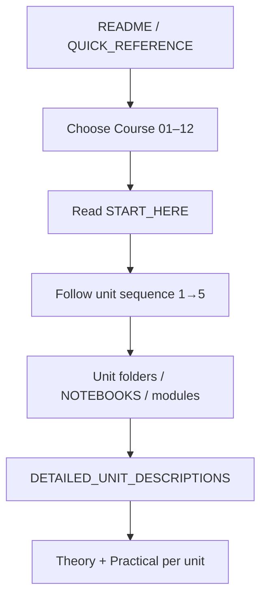

# Official Path → Detailed Units Flowchart

**Purpose:** Visual map from repo official path to [DETAILED_UNIT_DESCRIPTIONS.md](../../DETAILED_UNIT_DESCRIPTIONS.md) units.  
**Reference:** [LEARNING_FLOW_ALIGNMENT_REPORT.md](../../LEARNING_FLOW_ALIGNMENT_REPORT.md).

---

## 1. High-Level Flow

```
┌─────────────────────────────────────────────────────────────────────────┐
│  START: README → QUICK_REFERENCE_GUIDE / COMPLETE_COURSE_STRUCTURE      │
│  Then: Choose course → START_HERE → Unit folders/notebooks/modules      │
└─────────────────────────────────────────────────────────────────────────┘
                                      │
                                      ▼
┌─────────────────────────────────────────────────────────────────────────┐
│  SEMESTER 1                                                             │
│  Course 01 (Intro AI) → 02 (Python) → 03 (Math) → 04 (ML) → 05 (Data)  │
│  → 06 (Ethics)                                                          │
└─────────────────────────────────────────────────────────────────────────┘
                                      │
                                      ▼
┌─────────────────────────────────────────────────────────────────────────┐
│  SEMESTER 2                                                             │
│  Course 07 (NLP) → 08 (DL) → 09 (RL) → 10 (GenAI) → 11 (Deploy)        │
│  → 12 (Graduation Project)                                              │
└─────────────────────────────────────────────────────────────────────────┘
```

---

## 2. Per-Course Unit Path → Detailed Units

Each course has **5 units**. Unit sequence (1 → 5) matches **DETAILED_UNIT_DESCRIPTIONS.md**.  
Repo path varies by course:

| Course | Repo path type | Unit 1 | Unit 2 | Unit 3 | Unit 4 | Unit 5 |
|--------|----------------|--------|--------|--------|--------|--------|
| **01** | Unit folders | unit1-ai-foundations | unit2-ai-concepts | unit3-ml-basics | unit4-neural-networks-basics | unit5-generative-ai-intro |
| **02** | NOTEBOOKS/00–05 | 00 | 01 | 02 | 03 | 04, 05 |
| **03** | modules/module_01–05 | module_01 | module_02 | module_03 | module_04 | module_05 |
| **04–12** | unit1–unit5 folders | unit1-* | unit2-* | unit3-* | unit4-* | unit5-* |

**Detailed content:** For each course × unit, see **DETAILED_UNIT_DESCRIPTIONS.md** (§ Course N, Unit M).  
**Mapping exceptions:** Course 01 supplemental folders (unit2-search-algorithms, unit3-knowledge-representation); Course 08/10 unit structure vs spec documented in [LEARNING_FLOW_ALIGNMENT_REPORT §5](../../LEARNING_FLOW_ALIGNMENT_REPORT.md).

---

## 3. Mermaid Diagram (Official Path)



---

**Last updated:** With deep-dive execution; flowchart created per plan.
